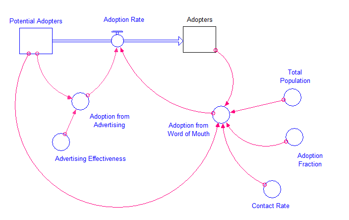
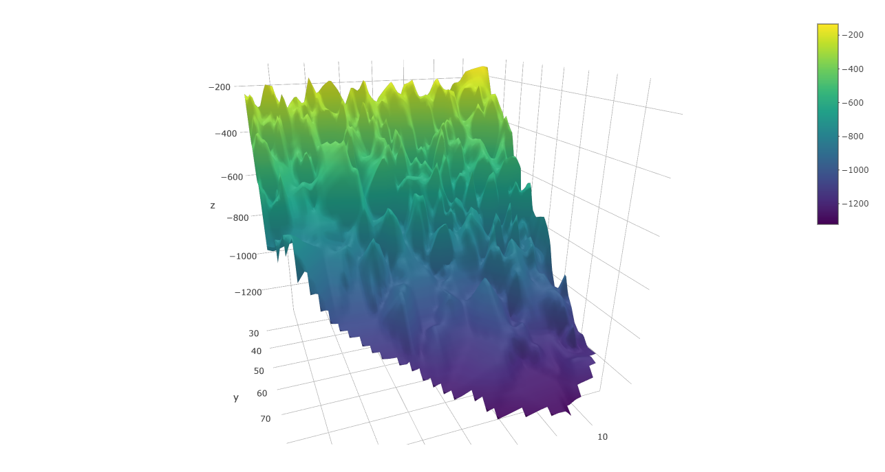

```{r setup, include=FALSE}
knitr::opts_chunk$set(echo = FALSE)
```

```{r, echo=FALSE}
# Carregando Funcoes e Rodando o Modelo Préviamente
source("funcoes.R")
source("modelo-difusao.R")
```

Este documento servirá como um balão de ensaio. Como a Análise RDM é nova para todos nós, primeiro irei realizar a estruturação da análise com um modelo relativamente simples, com o propósito de aprender a realizar a análise. Ele irá conter todos os elementos analíticos da aplicação do modelo, e servirá como molde da estrutura do capítulo de resultados da dissertação. Esta seção utilizará como base o modelo de difusão de clientes observado em Morecroft (200x).

Citando @Lempert2006

#### Estruturação da Decisão - XLRM

Conforme recomendado por @Lempert2006, o primeiro passo da Análise RDM é a estruturação da decisão.

##### Contextualização
[A versão final possuirá uma seção de contextualização sobre o problema em questão.]

##### X - Incertezas

```{r, echo=FALSE}
# Fazendo Output dos parâmetros do modelo
library(knitr)
knitr::kable(params, caption = "Tabela de Parâmetros.")
```

##### L - Decisões

##### R - Modelo

Esta seção apresenta o modelo para a análise necessária.

 

Equações do Modelo:

Potential Adopters

$$PA = \int_{0}^{t} - AR \ dt$$

Adopters

$$A = \int_{0}^{t} AR \ dt$$

Adoption Rate

$$AR = AA + AW \ dt$$

Adoption from Advertising

$$AA = ADVEFF * sPotentialAdopters \ dt$$

Adoption from Word of Mouth
$$AW = aContactRate * sAdopters * (sPotentialAdopters/aTotalPopulation) * aAdoptionFraction \ dt$$

##### M - Métricas de Medição

#### Geração de Casos

Em geração de casos posso mostrar o "Design de Experimentos."


#### Análise dos Casos Gerados

Este gráfico mostra os resultados gerados...

```{r}
plot_replicacoes
```

E este gráfico mostra um gráfico com variáveis incertas...


 


#### Descoberta de cenários


#### Análise de Tradeoffs
Try executing this chunk by clicking the *Run* button within the chunk or by placin

# References