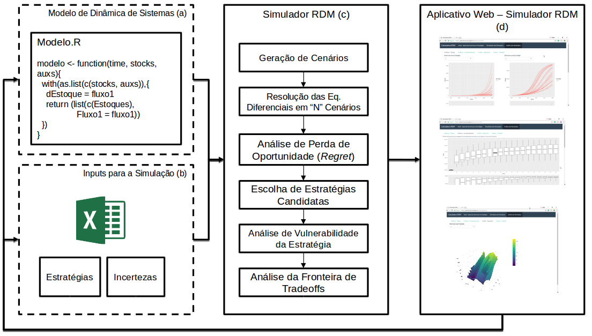
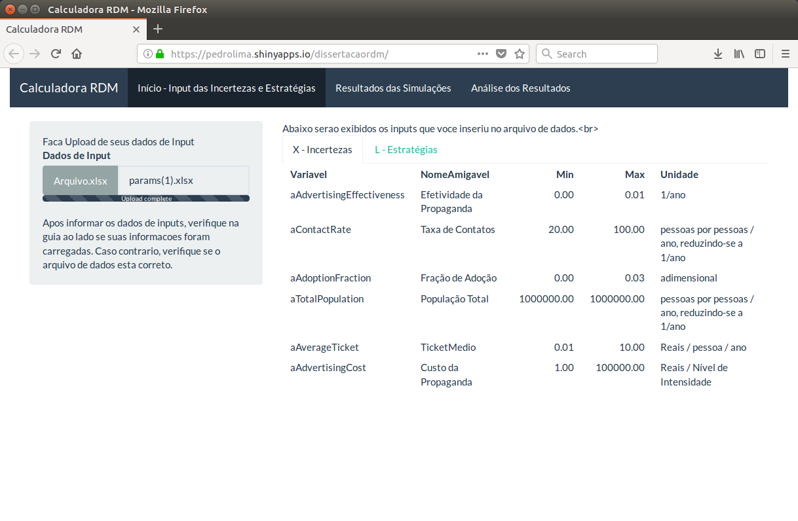
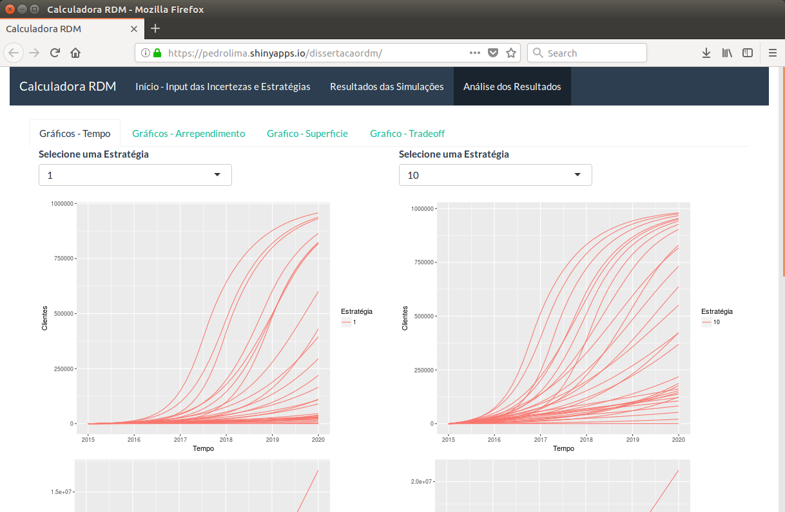
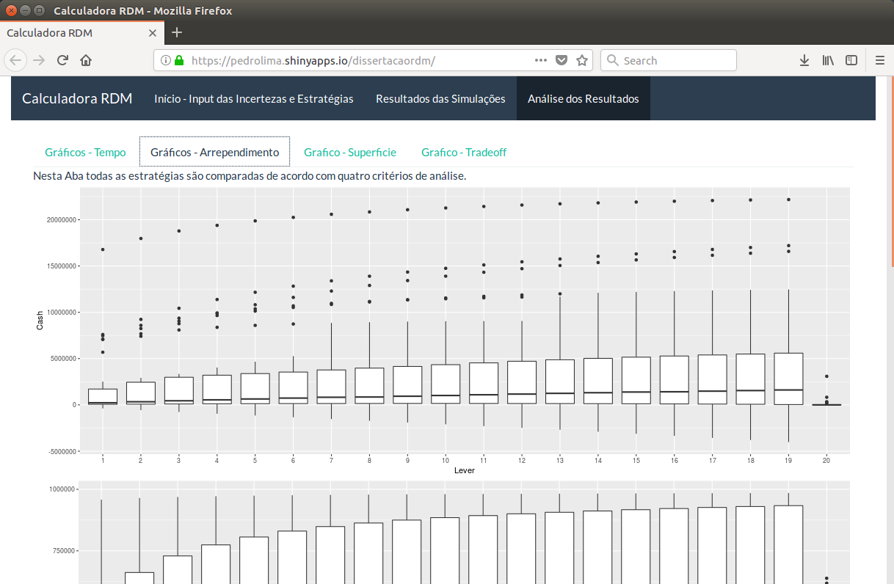
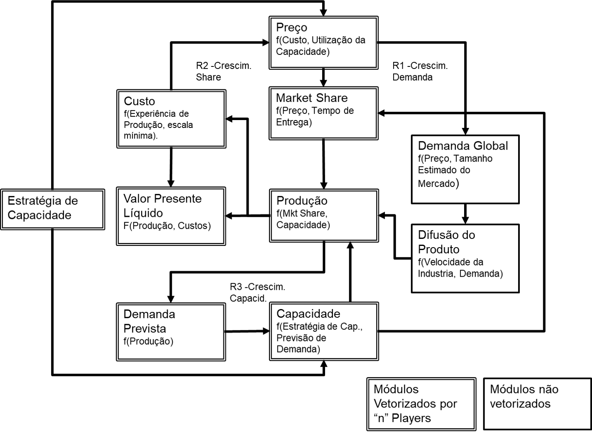

```{r setup, include=FALSE}
knitr::opts_chunk$set(echo = FALSE, fig.align = "center")
library(ggplot2)
library(ggpubr)
```

# Introdução:

Problematização sobre os desafios que a incerteza impõe à tomada de decisão estratégica.

## Objeto e Questão de Pesquisa: 
- Objeto: Avaliação de Decisões Estratégicas sob incerteza profunda. Uso o framework de processo de decisão estratégica do mintzberg para localizar o objeto da pesquisa.

- Questão de Pesquisa: "Quais são as contribuições da Modelagem Exploratória (EMA) e do Robust Decision Making (RDM) para a avaliação de decisões estratégicas organizacionais em situações de incerteza profunda?"

## Objetivos 

### Objetivo Geral

"Analisar as contribuições da EMA e do RDM para a avaliação das decisões estratégicas em situações de incerteza profunda."

### Objetivos Específicos

a) identificar abordagens para avaliação de decisão estratégica sob incerteza profunda;
b) instanciar o RDM no contexto empresarial;
c) avaliar a instanciação do RDM no contexto empresarial;
d) identificar heurísticas contingenciais na aplicação do RDM no ambiente empresarial.

## Justificativa
Argumentação sobre as limitações das abordagens para tomada de decisão de incerteza. Linha Geral de Argumentação:

- Abordagens Atuais apresentam limitações sob incerteza profunda;
- Existe o RDM (e outros métodos);
- Não existe menção ao RDM na literatura de estratégia em negócio;
- O trabalho contribui realizando uma "exaptação" da abordagem.


# Fundamentação Teórica

## Avaliação de Decisões Estratégicas Sob Incerteza Profunda

### Avaliação de Decisões Estratégicas

### Níveis de Incerteza e Incerteza Profunda

## Abordagens para Avaliação de Decisão sob Incerteza Profunda

### Identificação de Artefatos

### Contextos de Aplicação do RDM

## RDM - Robust Decision Making (...)

# Método de Pesquisa (...)

# Contexto de Aplicação - Indústria da Manufatura Aditiva

Links Interessantes para ler e citar:

Nova Impressora 3D que imprime 10 x mais rápido que as demais:
http://www.sciencedirect.com/science/article/pii/S2214860416303220

https://www.technologyreview.com/the-download/609607/blink-and-youll-miss-how-fast-this-souped-up-3-d-printer-makes-prototypes/?utm_source=facebook.com&utm_medium=social&utm_content=2017-11-30&utm_campaign=Technology+Review


Impressão 3D na manufatura:
https://www.technologyreview.com/s/604088/the-3-d-printer-that-could-finally-change-manufacturing/


As discussões desta seção provavelmente irão para o final do capítulo 2.

## Comportamento da Demanda de Impressora 3D

## Principais Players do Mercado

## Comportamento de Variáveis Relevantes

## Sub-divisão dos mercados potenciais da Impressão 3D

## Delimitações do Trabalho

## Questões relevantes levantadas para a simulação.

Questões não respondidas que o meu trabalho pode responder:

- Como pode se comportar a demanda por impressoras 3D?

- Que Estratégia de Capacidade um Player deve adotar para este ramo: Estratégia Agressiva de penetração no mercado ou estratégia "Conservadora". 

- Esperar o cenário melhor se configurar para agir ou agir para conquistar market share de modo preemptivo?

- Quais são as incertezas mais importantes para a determinação da estratégia de capacidade mais adequada?

As questões acima devem levar à escolha da simulação de dinâmica de sistemas como abordagem ideal.
Não devem ser colocadas questões acima que a análise não irá ajudar a responder.

Quais players simular.

Que aspectos simular ou não

# Revisão de Modelos

Em resposta às necessidades do item anterior, os modelos de difusão de novos produtos devem ser avaliados, culminando no modelo do Sterman (XXX). As características dos modelos podem ser brevemente descritas para ajudar nesta delimitação.

[Quadro de Comparação dos Modelos]


(Escrever no Word para facilitar as citações.)

Falar sobre cada modelo e mostrar o Quadro da análise dos modelos. Considerar que cada um dos modelos considera e suas contribuições e limitações para o trabalho atual. Ressaltar o que o Sterman considera e que os demais não consideram para justificar a escolha do Sterman como ponto de partida.


O modelo proposto inicialmente por Sterman (XX) foi utilizado como ponto de partida deste trabalho, por possuir uma série de características desejáveis para este trabalho. Em primeiro lugar, o modelo não é restrito a monopólios, como o modelo de Bass (XX) e outros modelos deste trabalho (identificar e citar aqui). Além disso, o modelo possui uma estrutura de dinâmica competitiva considerando a interação de diversos fatores presentes na Indústria da Manufatura Aditiva, incluindo curvas de aprendizagens, diferentes players expandindo sua capacidade produtiva em função da demanda prospectada no mercado.


# Ferramenta Computacional para a Análise RDM

O objetivo desta seção é descrever a ferramenta computacional desenvolvida no âmbito desta dissertação para viabilizar a operacionalização da análise RDM. A decisão por desenvolver a análise nesta dissertação por meio deste ambiente aberto, ainda que em princípio mais custosa, teve por objetivo realizar a análise RDM com a máxima independência possível, sem recorrer à ferramentas terceiras ou privadas. Além disto, o desenvolvimento desta ferramenta computacional permitirá que os resultados desta dissertação sejam reproduzidos. Recomenda-se ao leitor interessado que acesse a ferramenta disponível no link (http://bit.ly/pnldissert) Deste modo, procura-se atender aos requisitos de reprodutibilidade em trabalhos baseados em simulação computacional preconizados por Rahmandad e Sterman (2012).

A primeira barreira para a realização da Análise RDM é a disponibilidade de ferramentas computacionais amigáveis para a operacionalização da análise exploratória. Embora existam frameworks de desenvolvimento úteis para a modelagem exploratória (como o EmaWorkbench (KWAKKEL, 2013) o OpenMORDM (HADKA et al., 2015) e o Rhodium(XXX)), tais ferramentas implicam em empecilhos para a utilização no contexto deste trabalho. Em primeiro lugar, estas ferramentas requerem que seu usuário final programe o modelo computacional e insira os parâmetros diretamente no código fonte. Embora propiciem um ambiente de desenvolvimento adequado para programadores proeficientes nas suas respectivas linguages de programação, estas bibliotecas carecem de interfaces para que os usuários finais interajam com os inputs da simulação (ex.: alterem os parâmetros de entrada e estratégias a serem simuladas), e avaliem imediatamente o resultado das simulações.

A ferramenta EmaWorkbench, desenvolvida na linguagem python não possui interface gráfica, não suporta integração com o software de dinâmica de sistemas iThink, ou com modelos desenvolvidos na linguagem R. Neste sentido, a ferramenta requer que o modelo seja desenvolvido em uma ferramenta como o Vensim, Excel ou um modelo utilizando a linguagem Python.

Considerando a necessidade de flexibilidade durante a execução deste trabalho, o pesquisador optou por desenvolver rotinas computacionais próprias utilizando a linguagem R e bibliotecas de código aberto disponíveis no repositório CRAN. A linguagem R possui bibliotecas para a integração numérica do modelo computacional (biblioteca deSolve), para a calibração do modelo (FME), para a disponibilização dos resultados em um aplicativo web (shiny), e para a visualização interativa dos resultados (ggplot2, plotly). Utilizando tais bibliotecas em conjunto, foi possível implementar as rotinas computacionais para a operacionalização do RDM, cuja estrutura é ilustrada na Figura (XXX).

## Módulos da Ferramenta Computacional

A ferramenta computacional foi projetada com o objetivo de receber uma planilha de inputs de dados (contendo a definição de estratégias a serem simuladas e incertezas a serem consideradas), e a partir do modelo computacional desenvolvido, rodar os passos da análise RDM com a maior grau de automação possível. A seguir são descritos os quatro principais módulos da ferramenta (ilustrados na Figura (XX)), e suas principais funções, com o propósito de viabilizar seu uso ou adaptação em trabalhos futuros.

O primeiro componente necessário para a análise RDM é um modelo de simulação computacional. Por parte do RDM (e da análise exploratória em geral), não há uma limitação ou especificação quanto ao tipo de modelo a utilizar. Conforme Lempert (XXX 2006) esclarece, o framework de análise RDM pressupõe que modelos de simulação de "complexidade arbitrária" podem ser utilizados pela análise, desde que sejam capazes de relacionar decisões da empresa à métricas de resultado. A ferramenta computacional em questão propõe-se a suportar específicamente a utilização de modelos de dinâmica de sistemas desenvolvidos na linguagem R, de modo compatível à biblioteca de integração numérica deSolve.



O segundo componente (b) trata-se de uma planilha com formato padronizado, contendo as estratégias a serem simuladas e incertezas, incluindo valores máximos e mínimos para cada parâmetro. Esta planilha possui duas entradas de dados, com o propósito de permitir a entrada de incertezas (elemento X do framework XLRM) e de estratégias (elemtno L do framework XLRM). A tabela de incertezas deve conter uma linha por variável considerada incerta, e seus ranges plausíveis, como é ilustrado no Quadro (XX).

| **Variavel** | **Nome Amigável ** | **Min** | **Max** | **Unidade** |
| ------------ | ------------------| -------| -------- | -------------|
| Incerteza1 | Incerteza ABC | 5 | 10 | R$ |
| Incerteza2 | Incerteza XYZ | 20 | 30 | venda / pessoa |
| ... | ... | ... | ... | ... |
| Incertezan | Incerteza xyz | 0 | 1 | % Market Share |
| Parametrofixo | Parametro ABC | 2,5 | 2,5 | Número de Pessoas |

Table: Entrada de Incertezas (X)

Uma vez enviado à ferramenta computacional esta tabela é exibida na ferramenta web, como pode ser observado na Figura (XX).



A estruturação deste input neste formato permite que um número arbitrário de parâmetros incertos seja utilizado pelo modelo, e que o usuário possa alterar os parâmetros minimos e máximos e observar o impacto desta alteração em relação à análise realizada sem a necessidade de alterar o código fonte do modelo. O segundo elemento da entrada de dados consiste na tabela de estratégias a simular, que é ilustrada no Quadro (XX).

| **Lever** | **LeverCode ** | **Variavel1** | **...** | **Variaveln** |
| ------------ | ------------------| -------| -------- | -------------|
| 1 | Estratégia 1 | 1 | 0 | 0 |
| 2 | Estratégia 2 | 1 | 0 | 1 |
| 3 | Estratégia 3  | 0 | 1,5 | 1,5 |
| ... | ...  | ... | ... | ... |
| n | Estratégia n  | 0 | 2,5 | 3 |

Table: Entrada de Estratégias (L)

Neste segundo quadro, cada linha da tabela representa uma estratégia, ou seja, uma combinação única de decisões a serem simuladas em cada um dos "n" futuros plausíveis definidos. As colunas "Lever" e "LeverCode" são fixas identificam a estratégia a ser simulada. As demais colunas correspondem à nomes de variáveis, que devem corresponder aos nomes constantes no modelo computacional, e os valores que estas variáveis assumirão.

A partir do modelo computacional (presente na calculadora web) e dos inputs informados, a calculadora executa uma série de análises para a execução da análise RDM. O quadro (XX) sintetiza o papel de cada uma destas etapas. A seção de análise dos resultados neste trabalho detalhará o significado de cada uma destas etapas.

| **Etapa** | **Função da Etapa** |
| ----------------| ----------------------------------------------------|
| Geração de Casos | Nesta etapa a técnica Latin Hypercube Sampling (Citar XX) é usada para gerar um conjunto de casos contra os quais cada estratégia será testada. Todas as incertezas informadas na planilha são variadas simultâneamente de modo a representar uma ampla gama de situações às quais as decisões da empresa poderão ser submetidas. |
| Resolução das Equações Diferenciais | Para cada um dos casos gerados, o algoritmo emprega a biblioteca deSolve para a integração numérica do conjunto de equações indicados no modelo. Nesta etapa, a variável de interesse é calculada (ex.: Valor Presente Líquido) |
| Análise de Perda de Oportunidade | Nesta etapa o algoritmo calcula a perda de oportunidade (regret) de cada estratégia em cada cenário. Desta maneira, estima-se o valor monetário perdido pela empresa por não escolher a melhor estratégia dentre as disponíveis para o cenário em questão. |
| Escolha de Estartégias Candidatas | A partir da perda de oportunidade calculada, uma estratégia candidata é selecionada dentre as disponíveis, utilizando-se um critério (o critério adotado por lempert (menor percentil 75%) é adotado por padrão). |
| Análise de Vulnerabilidade da Estratégia | Este processo emprega o algoritmo PRIM para identificar cenários que melhor caracterizam as condições nas quais a estratégia candidata tem performance ruim. Este processo não pode ser automatizado completamente, devido à característica iterativa do algoritmo PRIM. |
| Análise da Fronteira de Tradeoffs | Considerando a caracterização da vulnerabilidade da estratégia escolhida, a fronteira de tradeoffs é calculada exibindo as estratégias que levam à uma menor perda de oportunidade no cenário onde a estratégia candidata é ruim. |


Destaca-se que os componentes (a) e (b) podem ser modificados conforme o caso a ser analisado, sem a necessidade de reprogramar todas as funções do Simulador (c), nem do aplicativo web desenvolvido (d). Esta seção não detalhará cada um dos componentes e análises propiciadas pela ferramenta computacional, as quais serão evidenciadas nas seções de análise seguintes.



[Parágrafo sobre a análise de perda de oportunidade para a definição da estratégia mais robusta segundo um determinado critério.]




# Modelo da Competição na Indústria de Impressoras 3D

Esta seção descreve o modelo computacional empregado neste trabalho. Como f na seção 2.X.X, este trabalho utilizou como ponto de partida o modelo proposto por Sterman (XX), visto que este possui uma série de características aplicáveis à indústria da manufatura aditiva. Inicialmente, a estrutura geral do modelo é delineada, e o papel e funcionamento de cada um de seus módulos é sintetizado. Em seguida, a formulação matemática do modelo é justificada, e as modificações realizadas em relação ao modelo original são explicitadas.

## Diagrama de Fronteiras do Modelo

A Figura (XX) ilustra os módulos do modelo e suas principais relações. Esta seção introduzirá as principais característsicas do modelo, e argumentará sua relação com a indústria da manufatura aditiva. Além disto, a seção  definirá as principais relações existentes entre os módulos e justificará a decisão pela inclusão de cada um destes módulos no modelo. Em seguida, a formulação matemática de cada um dos módulos será detalhada. Finalmente, esta seção também sintetizará as modificações empregadas no modelo original de Sterman (xx), justificando tais alterações.

Uma primeira característica importante para a compreensão do modelo é a escolha pela desagregação da maioria de seus módulos em diferentes players produtores de impressoras 3D. Tal desagregação permite que o modelo simule a performance individual de players, e não apenas o comportamento agregado da indústria. Desta maneira, o modelo permite simular a interação entre decisões estratégicas dos diversos players simultâneamente.

Um segundo aspecto importante para a compreensão do modelo é que o mesmo ocupa-se de decisões estratégicas relacionadas à capacidade produtiva da empresa. Em específico, o modelo ocupa-se de analisar estratégias de crescimento de capacidade agressivas versus estratégias conservadoras. Adotando uma estratégia agressiva, um player adota metas ousadas de market share buscando lançar-se à frente de seus concorrentes para obter escala de produção suficiente para reduzir seus custos e conquistar retornos crescentes. Em uma estratégia conservadora, o player define um market share alvo modesto, devido à incerteza relacionada ao mercado e aceita dividir uma parcela maior de seu share com seus concorrentes, correndo menos risco de possuir capacidade excedente.


| **Módulo** | **Necessidade de Modificação** | **Modificação Realizada** |
|--------|------------------------------|-------------------------------------|
| Market Share | Market Share é apenas dividido por preço e delay na entrega, enquanto a performance do produto não parece ser considerada. | Criar setor de investimento em P&D influenciando a performance do produto juntamente com a experiência de produção. |
| Capacidade | Estratégia de crescimento é "Conservadora" ou "Agressiva", e não possui opção adaptativa. | Avaliar primeiro as duas estratégias na primeira rodada do modelo e em seguida adicionar uma estratégia adaptativa (provavelmente a agressiva no início e conservadora no final). |
| Parâmetros | Parâmetros possuem valores iniciais não aderentes à indústria da manufatura aditiva. | Modificar parâmetros e calibrar modelo para a manufatura aditiva.
| Número de Players | Modelo original considera apenas dois players | Modificar para 10 players (considerar os 9 maiores players e agregar os demais em um player "outros".)|

Table: Modificações Realizadas em Relação ao Modelo Original




No modelo atual, a demanda global pelo produto é determinada em função do preço, e de parâmetros que estimam o tamanho do mercado potencial, e sua reação à acréscimos ou decréscimos no preço por meio de uma curva de preço versus demanda. A demanda global calculada obtida em equilíbrio com o preço é sujeita à um processo de difusão do produto. Considerar o processo de difusão de um novo produto é uma prática presente em diversos modelos similadres (Ex: Bass (XX), citar outros), visto que a difusão de um novo produto não é instantânea. A difusão do produto é dada a partir da demanda global determinada pelo preço, e parâmetros que medem a velocidade de difusão do produto no mercado alvo.

O próximo conjunto de módulos do modelo é vetorizado por produtores de impressora 3D (a partir deste momento denominados como players). Esta característica torna o modelo útil para a avaliação da decisão estratégica de e um player específico, e permite a consideração de decisões estratégicas de outros players sobre o resultado da estratégia de um player em questão.Este aspecto será essencial para simular situações onde players existentes no mercado possuem estratégias de crescimento agressivas ou conservadoras, e o como estas decisões impactam o resultado da estratégia de um dado player. De modo similar, esta característica permite simular o impacto positivo que a expansão de outros players pode ter, expandindo o mercado de tal modo que haja mais demanda global para os demais players.

Este aspecto é relevante para a representação da indústria da manufatura aditiva, visto que a adição de capacidade por outros players, e decisões relacionadas à sua precificação tendem à influenciar a decisão da empresa.


Em seguida, a produção de cada um dos players simulados no moeolo é estimada, utilizando as informações de demanda, capacidade dos players e market share estimado. A produção, de modo imediato, gera caixa para os players, atualizando seu valor presente líquido em caixa.

Três macro-enlaces de feedback podem ser visualizados nesta estrutura. O primeiro enlace, R1, tende à estimular o crescimento da demanda por meio da expansão do mercado. Uma vez que parcelas cada vez maiores da

No modelo proposto por Sterman (XX) dois players, inicialmente com a mesma capacidade produtiva, iniciam vendendo produtos a um mercado em expansão.

## Demanda Global

A demanda Total da indústria anual $D^T$ é formada pela soma de dois tipos de demanda. A demanda inicial $D^I$ dos produtos (ou seja, à primeira compra realizada por um usuário da impressora 3D), e à demanda oriúnda de recompras $D^R$, realizadas em função do fim da vida útil do equipamento.

$$D^T = D^I + D^R$$
A demanda inicial é calculada $D^I$ em função do número médio de unidades vendidas por clientes $\mu$ e do número de clientes $dA$ que adotou o produto em um intervalo de tempo $dt$:

$$D^I = \mu \frac{dA}{dt}$$

## Difusão do Produto

O crescimento do número de clientes $A$ que aderiram às impressoras 3D em um dado instante de tempo $t$ é um estoque modelado por meio do modelo padrão de difusão de Bass (XXXX). Neste modelo o crescimento da população de clientes que aderem à uma ideia é dependente do tamanho total da população $POP$, do número de clientes que não adotaram $N$, da fração de inovadores que adotam ao produto ano a ano independentemente de outros usuários $\alpha$ e do parâmetro $\beta$ que mede a força da difusão do produto por boca-a-boca. A não-negatividade da equação é garantida obtendo-se o máximo entre a equação e zero. Além disto, o valor inicial do número de clientes $A_{t_0}$ é calibrado a partir do númer......

$$ A_t = A_{t_0} + \int_{t_0}^{t}  MAX\left(0,N \left(\alpha + \beta \frac{A}{POP}\right)\right); A_{t_0} = \theta A^*$$

O número de consumidores potenciais $N$ é modelado como o máximo entre zero e a diferença entre o número de clientes que irá adotar o produto em algum momento $A^*$ e o número de clientes que adotou o produto $A$.

$$N = MAX(0, A^* - A)$$

O número de clientes que irá adotar o produto $A^*$ é calculado segundo uma curva de demanda linear, variando em função do menor preço encontrado no mercado $P^{min}$, e da inclinação da curva de demanda $\sigma$, que corresponde à $(A^*-POP^r)/(P^{min} - P^r)$. Para a calibração da curva de preço e demanda, um preço de referência $P^r$ e uma demanda de referência $POP^r$. Além disto, a demanda nunca será maior do que a população total $POP$, nem menor do que $0$. 

$$A^* = MIN \left(POP, POP^r * MAX \left(0, 1+ \frac{\sigma(P^{min} - P^r)}{POP^r}\right)\right)$$

A inclinação da curva de demanda $\sigma$, por sua vez, é calculada em função da população de referência $POP^r$, do preço de referência $P^r$ e da elasticidade da curva de demanda $\varepsilon_d$. 
$$\sigma = - \varepsilon_d \left(\frac{POP^r}{p^r}\right)$$

A demanda oriúnda da necessidade de substituição dos produtos depende do número de impressoras 3D já vendidos pela empresa $I_i$, e de uma taxa percentual de descarte de impressoras $\delta$. Esta taxa percentual de descarte de impressoras corresponde ao inverso da vida útil média das impressoras vendidas.
O modelo pressupõe que o número de  impressoras descartadas pelo fim da sua vida útil corresponde ao número de impressoras a serem compradas.

$$D^r = \sum_{i}{D_i} \ ; \ D_i = \delta * I_i$$


**Modificação:** Este pressuposto atua como um pressuposto "otimista" para os produtores de impressoras 3D, implicando que, no longo prazo o mercado alcançado pelas impressoras 3D nunca retornarão à outras tecnologias. Podemos modificar esta equação incluindo uma taxa $\alpha$ de impressoras que são descartadas, porém nunca substituídas. Pensar numa forma de modelar esta taxa.

$$D^r = \sum_{i}{D_i} \ ; \ D_i = \delta * I_i * \alpha $$
O número de impressoras 3D atualmente instaladas em consumidores $I_{i,t}$ de cada player corresponde à acumulação de entregas de impressoras $I_{i,t}$ e é reduzida pelo número de produtos descartados $D_{i,t}$, considerando uma quantidade inicial $I_{i,t_0}$ de impressoras instaladas no período inicial de simulação.

$$I_{i,t} = I_{i,t_0} + \int_{t_0}^{t} S_{i,t} - D_{i,t}$$

## Market Share

A atratividade de cada player é calculada com base em um modelo logit de decisão (citar). Neste modelo, a atratividade de cada um dos players é calculada de acordo com um conjunto de critérios competitivos. No modelo de Sterman (XX), são utilizados como critérios o preço do produto e o tempo de entrega.

**Modificação:** Criar um módulo para estimar um índice de performance das impressoras 3D influenciados por investimentos em Pesquisa e Desenvolvimento. Desta maneira, o Share de cada produto player pode ser dividido de acordo com a performance dos diferentes players.
Este módulo de performance do produto também pode ser influenciado pela curva de aprendizagem dos players.

$$A_i = exp \left({\varepsilon_p \frac{P_i}{P^r}}\right) * exp \left({\varepsilon_a (\frac{B_i}{S_i})/\tau^r}\right)$$

Com base na atratividade de cada player, o market share é definido normalizando-se a atratividade dos players em conjunto. Esta formulação garante que a soma do market share de cada um dos players será igual a 1.

$$S_i = A_i/\sum_{i}A_i$$

Finalmente, os pedidos ganhos por cada empresa $O_i$ são calculados de acordo com a Demanda Total da Indústria e de acordo com o seu share calculado. 

$$O_i = S_i * D^T$$

## A Firma

O lucro líquido a valor presente $\pi_{t}$ da firma $i$ é definido como um estoque calculado em função das receitas $R_i$ e custos fixos $C^f_i$ e variáveis $C^v_i$ da empresa, trazidos a valor presente por um fator $\rho$. Desta maneira, o lucro líquido da empresa no tempo $t$ será dado conforme esta equação:

$$ \pi_{t} = \int_{t_0}^{t} [R_i -(C^f_i+C^v_i)]  *  e^{-\rho * t} $$
As receita bruta da empresa é calculada a partir do número de produtos entregues $S_{i}$ pela empresa $i$ e do preço médio de seus produtos vendidos $\bar{P_i}$, que é obtido pela divisão do valor da carteira de vendas $V_i$ e de seu backlog $B_i$.

$$R_i = S_{i} * \bar{P_i} \ ; \bar{P_i} = \frac{V_i}{B_i}$$

O valor da carteira de vendas $V_i$  aumenta conforme a quantidade de pedidos faturados $O_{i,t}$  e seu preço $P_{i,t}*$, e decresce à medida que produtos são entregues aos seus clientes gerando receita $R_{i,t}$.

$$V_{i,t} = V_{i,t_0} + \int_{t_0}^{t} P_{i,t}*O_{i,t} - R_{i,t}$$

Os custos fixos da empresa variam de modo proporcional à sua capacidade produtiva $K_i$, segundo um custo fixo unitário $u^f_i$. Os custos variáveis, por sua vez, são proporcionais ao número de produtos entregues pela empresa $S_i$, e um custo variável unitário $u^v_i$.

$$C^f_i = u^f_i*K_i\ ; \  C^v_i = u^v_i * S_i$$

Com o objetivo de demonstrar um mecanismo de retornos crescentes, Sterman (XX) insere em seu modelo um mecanismo de redução de custos oriúndo da curva de experiência. Esta formulação pressupõe que os players são capazes de reduzir seus custos à medida que produzem uma quantidade maior de produtos, obtendo experiência em produção $E$, equivalente dimensionalmente ao número de impressoras 3D produzidas. Os custos fixos $u^f_i$ e variáveis $u^v_i$ unitários caem à medida que a experiência $E$ aumenta em relação à experiência inicial $E_0$.

$$u^f_i = u^f_0(E/E_0)^\gamma ;\ u^v_i = u^v_0(E/E_0)^\gamma; \gamma = log(\Gamma)/log(2)$$

A amplitude desta redução é calibrada apartir de custos fixos e variáveis iniciais $u^f_0$ e $u^v_0$, e de um parâmetro $\Gamma$ que representa a força da curva de experiência. Esta formulação permite que os players em um primeiro momento ampliem suas margens, e também permite que os mesmos reduzam seus preços com o objetivo de alcançar uma fatia maior de mercado. A Figura (XX) demonstra sensibilidade da relação não linear entre produção acumulada $E$ e custos $u^f_i$ e $u^v_i$, conforme varia a força da curva de experiência $\Gamma$.

```{r figlearningcurve, fig.cap="Relação entre Produção Acumulada e Custos"}
gerar_grafico_curva_experiencia()
```


Tal comportamento está em consonância com os dados observados na indústria da manufatura aditiva. Os preços das impressoras 3D tem caído expressivamente. Esta formulação, portanto, constitui-se como uma explicação estrutural para a queda dos preços nesta indústria. Esta formlua pressupõe que não há troca de experiência entre os players, e que não há "perda de experiência" de um determinado player.

A experiência $E_{i,t}$, por sua vez, é obtida a partir da acumulação da produção de cada player $E_{i,t}$.

**Ponto para possível modificação**. É possível imaginar um cenário onde, a longo prazo, a experiência obtida por um player é difundida para os demais players por meio de "cópias" e engenharia reversa. Seria possível imaginar uma forma de imaginar a uniformização do conhecimento, levando vantagens de curto prazo tenderem a se normalizar no longo prazo. Talvez seja mais inteligente levar essa ideia direto para o possível módulo de P & D.

Esta curva, sozinha, pode não explicar porque alguns players com menor volume de produção conseguem obter custos competitivos no mercado. Uma empresa talvez tenha apenas uma vantagem temporária em relação aos demais players. Este é um ponto a pensar, pois esta curva de experiência influencia os preços, que influenciam todos os demais comportamentos do modelo.

Este fator não "desmerece" o artigo do Sterman, visto que este pressuposto atua contra a hipótese dele, e o argumento que ele quiz usar não foi esse.

$$E_{i,t} = E_{i,t0} + \int_{t_0}^{t} S_i$$

### Produção

O presente modelo diferencia a produção real da empresa, a produção desejada, e sua capacidade. Pressupõe-se que a empresa busca maximizar sua produção, logo sua produção corresponderá ao mínimo entre a sua capacidade produtiva e sua produção desejada. O modelo proposto por Sterman (XX) foi idealizado para representar decisões estratégicas de longo prazo, e não se dedicou a detalhar mecanismos de uma cadeia de suprimentos à jusante ou à montante de cada um dos players. Por este motivo, a produção realizada pela empresa corresponde às entregas, desprezando a representação de estoques na cadeia de suprimentos da empresa. Considera-se a manutenção deste pressuposto adequada para os objetivos deste trabalho.

$$Q_i = MIN(Q_i^*,K_i); S_i = Q_i$$
Seguindo-se a lei de Little, o tempo médio de entrega corresponde à razão entre o backlog à taxa de entrega.

$$\tau_i  = B_i / Q_i$$
O modelo pressupõe que cada uma das empresas possui um tempo de entrega alvo, ajustando sua taxa de produção à este tempo de entrega e ao backlog formado. Sendo assim, a taxa de produção alvo depende do backlog formado e desta taxa de entrega alvo.

$$Q_i^* = B_i /\tau_i^*$$

Por fim, o backlog de produção da empresa cresce com a chegada de pedidos e diminui com o envio de de produtos.

$$B_{i,t} = B_{i,t0} + \int_{t_0}^{t} O_i - Q_i$$

### Capacidade

Neste modelo, a capacidade da empresa não pode se ajustar imediatamente à demanda. Sterman (XX) propõe a utilização do operador $\varphi$ Erlang Lag, utilizado frequentemente para representar o delay embutido em processos de ajuste de capacidade (Sterman XX):


$$K_i = \varphi(K^*,\lambda)$$

A capacidade Alvo da Empresa $K^*$, por sua vez, é obtida a partir do market share alvo da empresa $S^*$, da demanda prevista para a indústria $D^e$ e da taxa de utilização de capacidade $u^*$. A capacidade ainda é restrita a uma mínima escala de produção eficiente $K^{min}$.

$$K^* = MAX(K^{min}, S^* * D^e/u^*)$$

O modelo pressupõe que os players do mercado realizam estimativas de previsão de demanda $\lambda$ anos à frente da demanda prevista com o objetivo de ajustar sua capacidade produtiva à demanda. Desta maneira, a demanda prevista $D^e$ é estimada a partir da demanda reportada na indústria $D^r$ e da taxa esperada de crescimento da demanda $g^e$. O modelo adota como pressuposto que as empresas extrapolam a demanda passada da indústria para prever a sua demanda futura.

$$D^e = D^r * exp({\lambda * g^e})$$

A taxa de crescimento da demanda, por sua vez, é estimada a partir de um horizonte histórico usado para a previsão $h$, comparando a reportada no período atual $D^r_t/$ e a demanda reportada no período $t-h$, $D^r_{t-h}$.

$$g^e = ln(D^r_t/D^r_{t-h})/h$$

O modelo também admite que a empresa não possui a informação da demanda instantânea $D^T$. Desta maneira, a demanda reportada $D^r$ não corresponde à demanda corrente, visto que há delays no processo de comunicação do volume de vendas, mas sim ajusta-se à esta variável por meio de uma suavização exponencial de primeira ordem, conforme o parâmetro $\tau^r$ de suavização.

$$dD^r/dt = (D^T  - D^r)/\tau^r$$

### Estratégia de Capacidade da Firma

A variável de decisão criada no modelo de Sterman refere-se à estratégia de capacidade da firma. Sterman (XX) utiliza duas estratégias de capacidade distintas. Se a firma busca uma estratégia agressiva, a mesma busca um share dominante do mercado. Desta maneira a empresa define como o seu market-share alvo o máximo entre seu share mínimo desejado $S^{min}_i$, e o share que a empresa visualiza que outros players não atenderão $S^u_i$. Uma estratégia conservadora, por outro lado, define um market share máximo $S^{max}_i$ que está disposta a ocupar no mercado. Caso a empresa observe que não haverá demanda suficiente para este market share em função de seus outros concorrentes, a empresa aceita como meta apenas o market share que outros players não atenderão $S^u_i$.

$$S^* =  \begin{cases} MAX(S^{min}_i, S^u_i), \ if \ Str_i = Agress. \\ \\ MIN(S^{max}_i, S^u_i), \ if \ Str_i = Conserv. \end{cases}$$
O market share não disputado $S^u_i$ é calculado em função da demanda não disputada $D^u_i$ e da demanda prevista $D^e$.

$$S^u_i = MAX(0, D^u_i/D^e)$$
A demanda não contestada é obtida a partir da soma das capacidades de outros players esperada, da taxa de utilização da indústria e da demanda prevista.

$$D^u_i = D^e - u^* \sum_{j \neq i}K^e_j$$
A capacidade dos competidores esperada é obtida considerando que os players não possuem acesso à informação perfeita sobre o planejamento da capacidade dos outros players. Em um extermo, os demais players não tem nenhuma informação sobre a capacidade em construção dos outros players, e em outro extremo, os mesmos possuem informação perfeita sobre a capacidade em construção. O modelo utiliza um fator para expressar a parcela da capacidade em construção conhecida pelos demais players, permitindo que seja simulado o impacto desta variável sobre os resultados do modelo.

$$K^e_j = w K^{e^*}_j + (1-w)K_j $$

A capacidade alvo dos demais competidores é calculada considerando um delay de tempo, pressupondo que a empresa leva tempo para estimar e realizar os processos necessários para estimar a capacidade dos demais players.

$$dK^{e^*}_j/dt = (K^{*}_j - K^{e^*}_j)/\tau^c$$

### Preços

O modelo pressupõe que as empresas ajustam seus preços considerando seus custos unitários, a relação entre oferta e demanda e o seu market share atual e o market-share desejado. Na primeira parcela da equação, um preço base é calculado de acordo com os custos fixos e variáveis unitários, e de acordo com um markup desejado.

$$P^C = (1+m^*) (u^f_i + u^f_i)$$

A partir deste preço base, a primeira parcelado preço alvo é calculada considerando a razão entre o preço base e o preço atual. Deste modo, se o preço base for maior do que o preço atual, a empresa tende a aumentar seus preços no futuro. A segunda parcela da equação relaciona a produção desejada da empresa com a sua capacidade efetiva, calculada a partir da sua taxa de utilização e sua capacidade. Novamente, se a produção desejada pela empresa é maior do que a sua capacidade, a empresa tende a aumentar seus preços, buscando otimizar a utilização de sua capacidade. Finalmente, a terceira parcela da equação utiliza a diferença entre o market share desejado pela empresa e seu market share atual. Deste modo, se o market share da empresa for menor do que o market share desejado, a empresa tende a reduzir seu preço, para alcançar o market share desejado.

$$P^*_i = MAX \left[u^v_i, P_i \left( 1 + \alpha^c \left( \frac{P^c_i}{P_i}-1 \right) \right) \left( 1 + \alpha^d \left( \frac{Q^*_i}{u^*_iK_i}-1 \right)  \right) \left( 1 + \alpha^s \bigg( S^*_i - S_i \bigg) \right) \right]$$
Em uma situação onde o preço atual é igual ao preço base, a produção desejada é igual à capacidade efetiva, e o market share atual é igual ao market share desejado, não realizará mudanças em seu preço. Caso qualquer uma destas igualdades não seja satisfeita, a empresa mudará seu preço alvo para um novo valor. Além disto, o modelo pressupõe que as empresas do modelo não precificarão seus produtos abaixo do custo variável. 

A partir do preço alvo calculado, pressupõe-se que processos burocráticos não permitem que as empresas ajustem seu preço instantâneamente. Desta maneira, obtém-se o preço praticado pelos players por meio de uma suavização exponencial de primeira ordem, considerando um tempo de ajuste.

$$dP_i/dt = (P^*_i-P_i)/\tau^p$$

## Implementação do Modelo Computacional

O modelo matemático descrito na seção anterior foi implementado no software R. O código fonte implementado no software R está disponível no Apêndice (XX). Adicionalmente, o modelo  foi implementado no software Ithink 10.0.3, com o propósito de verificar a consistência dos resultados obtidos no software R. Considerando que a integração numérica invariavelmente traz erros ao processo do calculo, (Sterman XXX).

O modelo foi implementado segundo as diretrizes constantes em Dungan (XXXX), e utilizou a biblioteca deSolve (procurar e Citar XXXX) para a resolução das equações diferenciais.

Os resultados deste trabalho podem ser observados no link bit.ly/reproddissertpnl.


### Testes Estruturais / Testes de Valores Extremos

## Calibração do Modelo e Comparação com Dados Históricos

A modelagem exploratória, per si, abandona a premissa de que modelos de simulação computacional apenas serão úteis se validados (Bankes XX). Ainda assim, os modelos podem ser verificados visando avaliar sua consistência interna, bem como os seus resultados podem ser comparados com dados históricos para observar a capacidade do modelo em explicar o comportamento passado. (Sterman XXXX) Considerando estas premissas, esta seção apresenta os testes realizados no modelo.

[Explicar o Procedimento de Calibração, fonte dos dados e objetivos da calibração.]

Calibração da Demanda Global:

```{r}
p1
```


```{r}
### Testes Estruturais / Testes de Valores Extremos
p2
```


Variáveis utilizadas na calibração e erros:

```{r}
knitr::kable(cost$var)
```


Tabela de Resíduos da Calibração:

```{r}
knitr::kable(cost$residuals)
```

Parâmetros calibrados com este procedimento:

```{r}
knitr::kable(optPar)
```


## Análise RDM

### XLRM

### Geração de Casos (Rodada 1)

### Análise de Vulnerabilidades (Rodada 1)

### Modificações do Modelo para a segunda Rodada

### Geração de Casos (Rodada 2)

### Análise de Vulnerabilidades (Rodada 2)

### Análise de Tradeoffs

## Discussão dos Resultados

# Conclusões

# Apêndices

## Códigos da Ferramenta Computacional

### Modelo Computacional:

```{r}
modelo
```

### Rotinas para a Simulação RDM

- **Função Simular RDM e Escolher Estrategia**: Simula cenários do RDM, realiza a análise de perda de oportunidade e define a estratégia candidata utilizando um critério pré-determinado:

```{r}
simularRDM_e_escolher_estrategia
```

- **Carregar Inputs**:

```{r}
carregar_inputs
```

- **Obter LHS Ensemble**: 

```{r}
obter_lhs_ensemble
```

- **Ampliar Ensemble como Levers**: 

```{r}
ampliar_ensemble_com_levers
```


- **Simular**: 

```{r}
simular
```


- **Simular RDM**: 

```{r}
simular_RDM
```


- **Calcular Regret**: 

```{r}
calcular_regret
```


- **Resumir Variável Resposta**: 

```{r}
resumir_variavel_resposta
```


- **Escolher Estratégia Candidata**: 

```{r}
escolher_estrategia_candidata
```

- **Calcular e Resumir Regret**: 

```{r}
calcular_e_resumir_regret
```

- **Analisar Ensemble com Melhor Estratégia**: 

```{r}
analisar_ensemble_com_melhor_estrategia
```

- **Funções do Aplicativo Web** :

```{r}
server
```
