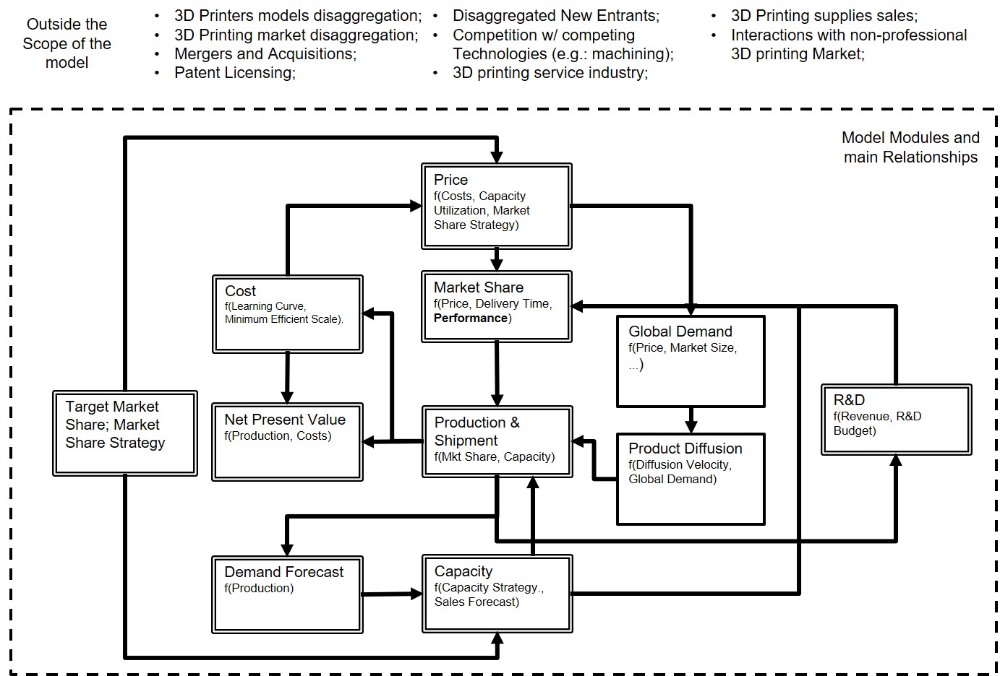

```{r setup, include=FALSE}
knitr::opts_chunk$set(echo = FALSE)
library(kableExtra)
library(DT)
```

# Introduction

## Motivation  - DMDU and Business Decisions
- Decision Makers in Business are faced with uncertainty, but...
- Testing quotation: [@Lima2018], [@Gong2017], [@Wholers2016].

## Key Features of 3D printing

- 3D printing allows us to manufacture parts with unprecedented **complexity**, in **low volume**;
- By doing so, entire manufacturing industries might be disrupted by AM, presenting challenges to ...

## Two Column Layout

\begincols
  \begincol{.48\textwidth}

- 3D printing allows us to manufacture parts with unprecedented **complexity**, in **low volume**;
- By doing so, entire manufacturing industries might be disrupted by AM, presenting challenges to ...


  \endcol
\begincol{.48\textwidth}

```{r test}
plot(pressure)
```

  \endcol
\endcols


## Why 3D Printing?

3D Printing is an emergint technology, but decision makers face uncertainty:

\begincols
  \begincol{.48\textwidth}

**Positive Evidence**:

- 3D printing Industry has seen two digits growth consistently in the last few years;
- 3D printing is already reshaping supply chains across industries (e.g.: prothesis, aerospace, etc.).

  \endcol
\begincol{.48\textwidth}

**Negative Evidence**:

- Major players have been observing declining profitability (e.g.: Stratasys, 3D Systems);
- Estimates of 3D printing growth diverge.

  \endcol
\endcols

## Shaping Events and Factors in the 3D Printing Industry

- Patent Dynamics & Patent Expiration:  (e.g. FDM Patent);
- R & D
- Strong Competition: 
- After the 3D printing Bubble, major players refocused their operations on industrial-grade printers;

# Problem Structuring / XLRM

## New Product Diffusion Models

There is a broad range of models portraying new product diffusion and technological substititions, beyond the basic Bass Diffusion Model [@Bass1969]:

- New Product Launch Strategy and timing between successive Product Generations [@Mahajan1996];
- Social Factors (e.g. Reference Users and Opinion Leaders - GE in the case of AM) [@Dattee2007];
- Competition Among Players and Substitution Between Product Generations [@Maier1998];
- Market Uncertainty [@Cui2011];
- Competition, Learning Curves, diffusion dynamics, Pricing and Capacity Strategies [@Sterman2007].

## What's the Problem

- Most of these models are employed with a **consolidative** approach (model parameters are estimated from past products);

- Some of them employ Senstitivity Analysis to explain under which conditions one might choose a different strategy based on thresholds of uncertain parameters.

## Sterman et. al (2007) Model

We have choosen [@Sterman2007] model as a bed-rock for our analysis, since :
 
- It Captures competition among players;
- It Captures increasing returns mechanisms (Learning Curve);
- It was fully documented, and provided the original model for comparisons, and;
- Our goal was not to **focus on model development** but to focus on employing an **exploratory modelling** approach to the 3D printing industry.

## X - Uncertainties

- Market size and diffusion velocity is still unknown, reflecting on diverging industry forecasts;

- Share prices of lead players have fallen between 71 % and 80 % in 17 months in 2017 [@Kelleher2015];

- Signals of Uncertainty for some, or Information Assimetry:

- Major AM Systems Manufacturers have seen falling Net profits;

## X - Uncertainties

- Successfull 3D printing adoption for manufacturing final parts depends on changing **product engineering processess** towards a **design for AM** posture. [@Aston2017]

- What the final market will prefer? A cheap, low-resolution printer or a high-quality, high-cost printer? 

- What if your competitor is able to provide a high-quality, low-cost printer?

- How much capacity will your oponents build? 

## L - Levers

From [@Sterman2007]:

- **Pricing and Capacity Strategy**: 
 - **Agressive**: Build capacity towards a target-market share; dynamicaly adjust your prices to leverage increasing returns (maybe at the expense of near term results);
 - **Conservative**: Define a minimum target market share, and adjust your pricing towards this share. Don't build excess capacity.

## L - Levers

Relevant factors from the AM industry:
- R & D and printer performance are key factor:
- Patents are used by leading companies to deter new entrants;

## R - Relationships

## M - Metrics

## Model Boundaries



# Case Generation

## Design of Experiments

- Full factorial design of these variables, resulting in 54 strategies:

|Variable | Meaning | Levels |
|-----------|---------------------------------------|------------------------|
| $S_1$ | Market & Pricing Strategy. Defines wether the player pursue an agressive marketing strategy to gain market share (by cutting prices and accepting excess capacity), or pursue a conservative strategy, | Agressive (1); Conservative (2)|
| $S_1^{max}$ or $S_1^{min}$ | Desired Market Share. For a Conservative Strategy, the player adopts the $S_1^{max}$, and for an Agressive Strategy, $S_1^{min}$ | 20%; 30%; 40%|
| $\eta_1$ | R & D budget, as a fraction of revenue. | 5%; 10%; 15%|
| $\kappa_i$ | Fraction of R & D budget released to open source technologies. | 0 %; 50 %; 90 % |


## Candidate Strategy NPV across scenarios

```{r, fig.align='center'}
plots_results$plots_linha_geral$plot_estrategia_candidata_vpl
```

## Global Demand across scenarios

```{r, fig.align='center'}
plots_results$plots_linha_geral$plot_estrategia_candidata_demanda_global
```

## 4 Players Net Present Value in a given scenario

```{r, fig.align='center'}
plots_results$plots_players$plot_players_vpl
```


## Net Present Value across strategies and Scenarios

```{r, fig.align='center'}
plots_results$plots_whisker$plot_whisker_lever_profit
```

## Regret across strategies and Scenarios

```{r, fig.align='center'}
plots_results$plots_whisker$plot_whisker_lever_regret
```

# Scenario Discovery

# Conclusions

## References
