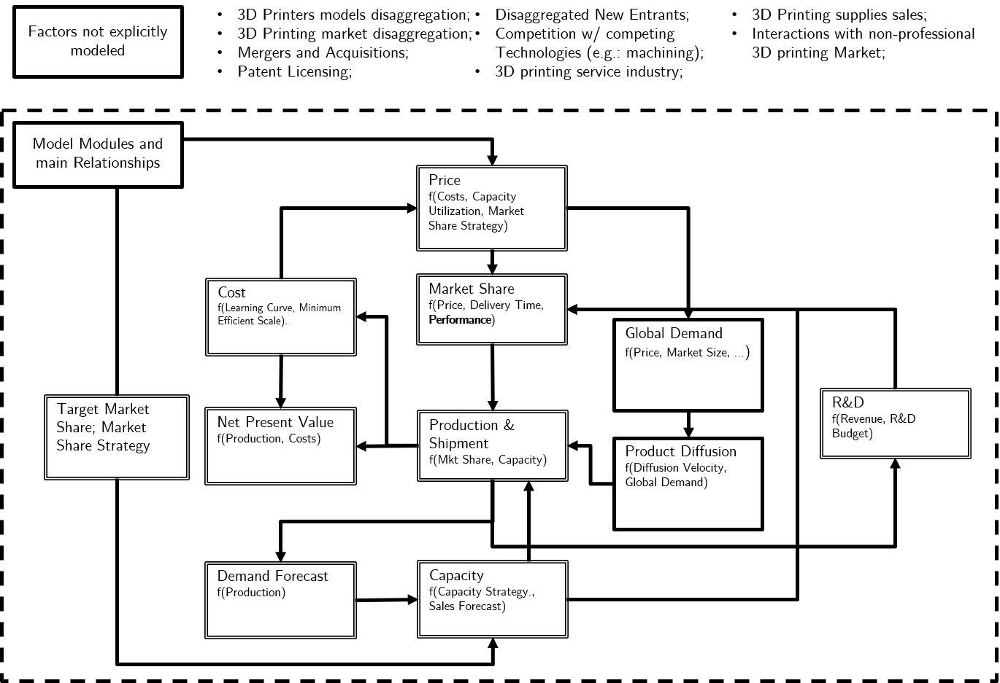

```{r setup, include=FALSE}
knitr::opts_chunk$set(echo = FALSE)
library(kableExtra)
library(DT)
```

# Introduction

## Motivation  - DMDU and Business Decisions
- Decision Makers in Business are faced with uncertainty, but...
- Testing quotation: [@Lima2018], [@Gong2017], [@Wholers2016].

## Key Features of 3D printing

- 3D printing allows us to manufacture parts with unprecedented **complexity**, in **low volume**;
- By doing so, entire manufacturing industries might be disrupted by AM, presenting challenges to ...

## Two Column Layout

\begincols
  \begincol{.48\textwidth}

- 3D printing allows us to manufacture parts with unprecedented **complexity**, in **low volume**;
- By doing so, entire manufacturing industries might be disrupted by AM, presenting challenges to ...


  \endcol
\begincol{.48\textwidth}

```{r test}
plot(pressure)
```

  \endcol
\endcols


## Why 3D Printing?

3D Printing is an emergint technology, but decision makers face uncertainty.

**Positive Evidence**:
 - 3D printing Industry has seen two digits growth consistently in the last few years;
 - 3D printing is already reshaping supply chains across industries (e.g.: prothesis, aerospace, etc.);

**Negative Evidence**:
 - Major players have been observing declining profitability (e.g.: Stratasys, 3D Systems);
 - Estimates of 3D printing growth diverge;
 

## Shaping events in the 3D Printing Industry

- Patent Dynamics & Patent Expiration (e.g. FDM Patent);
- Fierce Competition;
- After the 3D printing Bubble, major players refocused their operations on industrial-grade printers;

# XLRM

## Model Boundaries



# Case Generation

## Design of Experiments

- Full factorial design of these variables, resulting in 54 strategies:

|Variable | Meaning | Levels |
|-----------|---------------------------------------|------------------------|
| $S_1$ | Market & Pricing Strategy. Defines wether the player pursue an agressive marketing strategy to gain market share (by cutting prices and accepting excess capacity), or pursue a conservative strategy, | Agressive (1); Conservative (2)|
| $S_1^{max}$ or $S_1^{min}$ | Desired Market Share. For a Conservative Strategy, the player adopts the $S_1^{max}$, and for an Agressive Strategy, $S_1^{min}$ | 20%; 30%; 40%|
| $\eta_1$ | R & D budget, as a fraction of revenue. | 5%; 10%; 15%|
| $\kappa_i$ | Fraction of R & D budget released to open source technologies. | 0 %; 50 %; 90 % |


## Candidate Strategy NPV across scenarios

```{r, fig.align='center'}
plots_results$plots_linha_geral$plot_estrategia_candidata_vpl
```

## Global Demand across scenarios

```{r, fig.align='center'}
plots_results$plots_linha_geral$plot_estrategia_candidata_demanda_global
```

## 4 Players Net Present Value in a given scenario

```{r, fig.align='center'}
plots_results$plots_players$plot_players_vpl
```


## Net Present Value across strategies and Scenarios

```{r, fig.align='center'}
plots_results$plots_whisker$plot_whisker_lever_profit
```

## Regret across strategies and Scenarios

```{r, fig.align='center'}
plots_results$plots_whisker$plot_whisker_lever_regret
```

## Ranking Strategies by Regret

```{r, eval=F}
formatted_strategies_ranking = ranking_estrategias[,c(1, 6, 8, 9, 7, 3)]

# Parei aqui
formatted_strategies_ranking[,c(3,4,5)] = format_for_humans(formatted_strategies_ranking[,3])


column_names = c("Lever", "Capac. Strategy", "Desired Mkt Share", "R&D Inv.", "Open Source R&D", "Profit Regret 75% percentile")

knitr::kable(x = head(formatted_strategies_ranking, 10), col.names = column_names, digits = 2, format="latex", booktabs=TRUE) %>% 
  kable_styling(latex_options="scale_down")

```


# Scenario Discovery

# Conclusions
